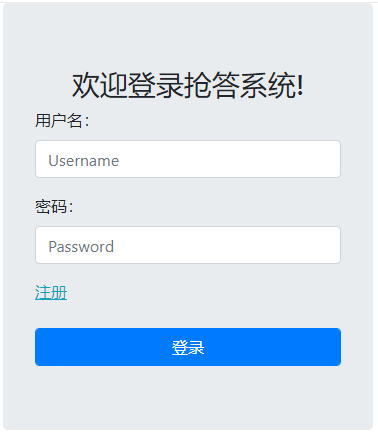
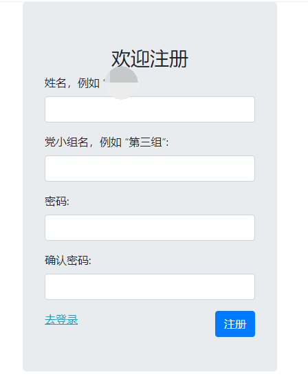

# Django在线Web抢答系统

Django在线Web多人抢答系统  
  
  
  

## 说明
因为我们支部需要使用，所以花了两个小时完成的。
使用python、Django和bootstrap进行实现，数据库就用的SQLlight，不需要额外配置。搭建和使用非常简单，所以放上来。  
有多余的代码在里面，请忽略，是以前学的时候的基础框架。  

## 环境配置

自行安装python 3.6及以上
```
pip install Django
```
## 使用方法
windows使用cmd或powershell, Linux使用终端

```
...path_to_DjangoWebCAS/> cd mysite/
...path_to_DjangoWebCAS/mysite> python manage.py runserver 0.0.0.0:8000 --insecure
```

然后在浏览器中输入地址即可开始访问。  
http://执行上述命令的机器的ip地址:8000/polls/index/  
例如：
执行上面命令的机器的IP地址为192.168.1.101
那么使用下面的地址进行访问  
http://192.168.1.101:8000/polls/index/
注：系统可以部署在云服务器上面，这样可以通过互联网进行访问。
### 主持人开始新的一轮的方法
主持人使用下面账户进行登录  
账户：admin  
密码: admin123  
登录后使用admin账户进行**抢答**即可开始新的一轮

## 联系作者
Email: 227229218@qq.com

## 版权声明
本系统服从GNU GPL开源协议。
